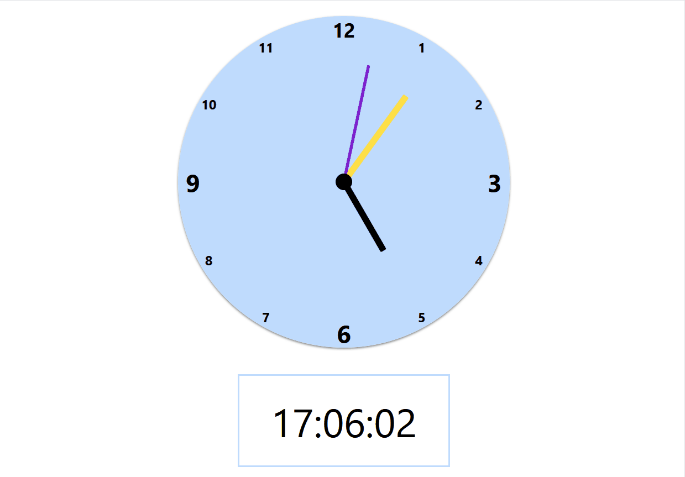

# Analog and Digital Clock ⏲️ 

This project is a experiment in creating an analog clock with a specific emphasis on utilizing [Tailwind CSS](https://tailwindcss.com/docs/installation).

## Usage of Tailwind CSS
Tailwind CSS was incorporated into this project using the CDN approach. The styles are applied through utility classes, providing a convenient and efficient way to structure and design the clock components.

## Technologies
Techs used to build this project:

## Overview 

